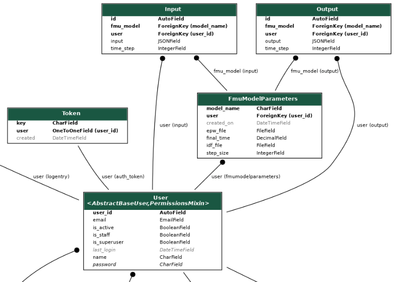

# SimApi Building Energy Co-Simulation Platform

This project aims to update and re-design an existing project found at [SimAPI repo](https://github.com/ElsevierSoftwareX/SOFTX_2018_29).
The objective of this project is to re-design and update the linked project using python, Django rest framework, 
Celery, Docker, and pyFMI to create an application capable of co-simulation between an Energy Management System and
a Functional Mock-Up Unit. The end goal is to deploy the project on a Docker swarm and simulate multiple fmu models
simultaneously. 

## Prerequisites
Version of docker and docker-compose 
```
Docker
- version >= 18.09.9

Docker-compose
- version >= 1.25.0
```


### Project structure

``` 
.
├── LICENSE
├── README.md
├── run_simulation.py
├── src
│   ├── docker-compose.yml
│   ├── simapi_simulation   # root directory for fmu related containers
│   │   ├── docker-compose.yml 
│   │   ├── fmu_generator   # container generates a .fmu. Place .idf, .epw, .idd in this folder
│   │   │   ├── docker-compose.yml
│   │   │   ├── Dockerfile
│   │   │   ├── Energy+.idd
│   │   │   ├── energy_plus_to_fmu.py   # run script to generate .fmu
│   │   │   ├── fmu_volume_monitor.py
│   │   │   ├── generator_api.py
│   │   │   ├── generator_tasks.py
│   │   │   ├── requirements.txt
│   │   │   └── volume
│   │   └── fmu_simulator   # Root folder for simulation scripts
│   │       ├── conda_requirements.txt
│   │       ├── docker-compose.yml
│   │       ├── Dockerfile
│   │       ├── fmu_location
│   │       ├── fmu_location_monitor.py # background process. Monitors fmu_location folder for .fmu creation
│   │       ├── incoming_json_monitor.py # background process. pyFMI simulation object lives and runs here.
│   │       ├── __init__.py
│   │       ├── requirements.txt
│   │       ├── simulator
│   │       │   ├── simulation_obj.py   # simulation object, initialize fmu model and do time_step
│   │       │   └── test_simulation_obj.py
│   │       ├── simulator_api   # Root folder for simulation internal API and generator API client
│   │       │   ├── django_client.py # test file not used
│   │       │   ├── generator_client.py  # post and get requests to generator client
│   │       │   └── sim_api.py # recevie post requests from web container. 
│   │       ├── simulator_tasks.py 
│   │       ├── store_incoming_json  # incoming_json_monitor.py monitors this folder for file updates
│   │       │   ├── model_params.json # file updated when client posts to django /init_model endpoint values used to init model instance 
│   │       │   └── time_step.txt # updated when client posts to django /input endpoint
│   │       ├── volume
│   │       └── volume_monitor.py
│   └── simapi_web  # Django project root
│       ├── Dockerfile
│       ├── manage.py
│       ├── Media
│       ├── requirements.txt
│       ├── rest_api    # Root folder for the restAPI django app
│       │   ├── admin.py
│       │   ├── apps.py
│       │   ├── __init__.py
│       │   ├── migrations
│       │   │   ├── 0001_initial.py
│       │   │   ├── __init__.py
│       │   ├── models.py
│       │   ├── permissions.py
│       │   ├── serializers.py
│       │   ├── tasks.py
│       │   ├── tests
│       │   │   ├── __init__.py
│       │   │   ├── test_models.py
│       │   │   └── test_views.py
│       │   ├── urls.py
│       │   └── views.py
│       ├── simapi_web
│       │   ├── asgi.py
│       │   ├── celery.py
│       │   ├── __init__.py
│       │   ├── settings.py
│       │   ├── urls.py
│       │   └── wsgi.py
│       └── TODO.py
├── test_bottle.py
├── test_django_json_fields.py  # Script posts inputs for simulation
├── test_django.py  # Script creates and initializes .fmu file 
├── test_input.py
└── test_setup_files    # place weather file and idf file here
    ├── a.epw
    └── a.idf
```

### API Database ER Diagram


## Instructions
To build and run the containers navigate to src folder and type in a terminal

```
docker-compose build

docker-compose up

On Linux sudo will be needed
```

With the -d flag each containers output will be printed to cmd. This is useful to ensure all containers started without 
error. Wait for container outputs to finish. 

## Working With Containers

The three main containers are web, simulator, and generator. The fourth is a postgres database container which the web container is a dependant.

```
Type "docker container ps" to ensure containers are running
```
### web
The web container holds the Django restAPI. It is necessary to make database migrations and migrate.

docker command to **makemigrations** and **migrate** using Django **manage.py**
```
Access web shell
docker exec -it web /bin/bash

python manage.py makemigrations

python manage.py migrate
```

Next create a superuser

```
python manage.py createsuperuser

Enter details below for superuser to avoid having to change login details in script
Email: user@user.com
Name: user
Password: user user88
```
Type exit when finished to close the web shell and return control to host cmd.

Optional:

Open http://127.0.0.1:8000/admin in a browser and log in as superuser to ensure everything is working.

### simulator
To run the simulation two cmd windows are needed. This will change in the next update.
Open two cmd windows in the project root folder **simapi-python/** in the first window run the command. 

```
docker exec -it simulator /bin/bash
```
You should now be in the simulator container shell. 
Now run

````
python incoming_json_monitor.py
````

With the **incoming_json_monitor.py** script running this window will be used to see the simulation outputs for each time step 

To initialize an FMU model open **simapi-python/test_django.py** and edit below sections. Take note of comments!
```python
# place .idf and .epw in simapi-python/test_setup_files/  replace a.idf and a.epw with new idf/epw
file = {'idf_file': ('a.idf', open('test_setup_files/a.idf', 'rb')),
        'epw_file': ('a.epw', open('test_setup_files/a.epw', 'rb'))}

# model initialization parameters
init_data = {
    'model_name': 'sim',   # change name each time script is run!
    'step_size': 600,   # step size in seconds. 600 secs = 10 mins
    'final_time': 24.0  # 24 hours = 86400 secs
} 

```
Save changes to **simapi-python/test_django.py**

Now open **simapi-python/test_django_run_simulation.py**

Ensure fmu_model field in input_data is the same value as model_name field in init_data from **simapi-python/test_django.py**
```python
i = 0   # first step
shade = 1.0  # input value. Stays same on each iteration. Will change on next update

# run 24 hour (86400sec) simulation at 10 minute (600sec) time steps
while i <= 86400:
    # Actual inputs for simulation object. Stores as json in db
    input_dict = {'time_step': i, 'yShadeFMU': shade}

    input_data = {
        'fmu_model': 'sim',    # Change name each time script is run!
        'time_step': i,     # 0 to 86400
        'input': json.dumps(input_dict)     # dumps input dict as json string to store in db
    }

    resp = requests.post(input_url, headers=header, data=input_data)

    # prints input_data on successful post
    print(resp.text)

    # increment time_step
    i += 600

    # wait for 1 second to allow data to pass through the system and simulation to process time step.
    # Will change next update
    time.sleep(1)
```
Save changes to **simapi-python/test_django_run_simulation.py**

In the second cmd window run 
````
python test_django.py
````
The script will output a login token and the initialize data for the model. 

Check the cmd window running the **simulator container** shell. It will take time for output.
Eventually the FMU initialization outputs will appear. The last two lines of output should be the text below.
```
Starting Simulation at 01/01/2011 for RUNPERIOD 1
ExternalInterface starts first data exchange.
```
This means the model is ready to receive inputs.

It would be worthwhile to have the cmd window running the **simulator container** shell and the cmd window specified
below open side by side. 

From the same cmd window that **test_django.py** was run, now run
```
python test_django_run_simulation.py
```

In this window you should see each input that has been posted to django. In the cmd window running the 
**simulator container** shell you will see the output generated for each time step.

Once the simulation has reached the final time step you will see
```
Writing tabular output file results using HTML format.
Writing final SQL reports
 ReadVarsESO program starting.
 ReadVars Run Time=00hr 00min  0.05sec
 ReadVarsESO program completed successfully.
 ReadVarsESO program starting.
 ReadVars Run Time=00hr 00min  0.02sec
 ReadVarsESO program completed successfully.
EnergyPlus Run Time=00hr 11min 59.59sec
EnergyPlus Completed Successfully.
[INFO][Slave] [ok][FMU status:OK] freeInstanceResources: Slave will be freed.
```
The process running in the simulator shell will finish. Restart the process and update the model name in 
**test_django.py** and **test_django_run_simulation.py** to run another simulation

A folder will be produced and can be found at
```
simapi-python/src/simapi_simulation/fmu_simulator/Output_EPExport_Slave
```
The contents of this folder are files generated after running a simulation.
The FMU can be found inside a folder located at
```
simapi-python/src/simapi_simulation/fmu_simulator/fmu_location
```
## Project Development

If you would like to run the Django API or simulation scripts without docker the following steps are required.

1. Install python Anaconda

2. Create a virtual env python=3.7

3. Run conda commands

   conda config --append channels conda-forge
   
   conda install -c conda-forge assimulo
   
   conda install -c https://conda.binstar.org/chria pyfmi

4. pip install -r [dev_requirements.txt](./dev_requirements.txt) to install project dependencies

If running the Django project without Docker is all that is required then you can stop here. 

If you would also like to run simulation scripts then it is necessary to install energyPlus on your machine. 

Version 9 is required.

For windows installation see [energyPlus windows](https://energyplus.net/installation-windows)

For Linux installation see  [energyPlus Linux](https://energyplus.net/installation-linux)


